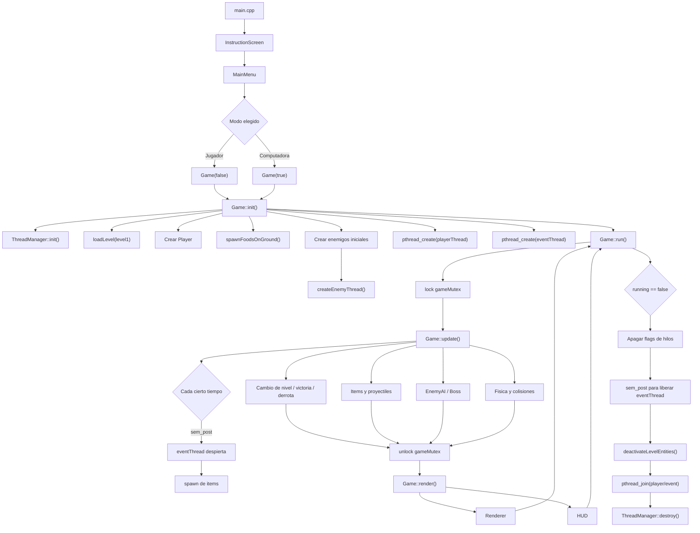
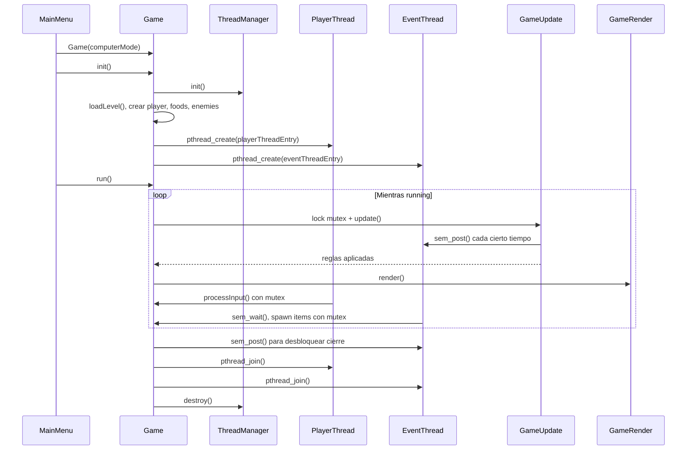

# Modulo core: flujo, hilos y clases principales

El modulo `core` es el centro de coordinacion del juego. No dibuja todos los
sprites por si solo, no resuelve toda la fisica y no contiene todos los menus.
Su trabajo es conectar esos sistemas en un orden estable para que la partida
avance: iniciar recursos, crear entidades, abrir hilos, actualizar reglas,
renderizar y cerrar limpiamente.

Los archivos principales del modulo son:

| Archivo | Responsabilidad |
|---|---|
| `include/Game.h` | Declara la clase que coordina una partida completa. |
| `src/core/Game.cpp` | Inicializa la partida, carga niveles, corre el loop y cierra recursos. |
| `src/core/GameActions.cpp` | Maneja input, modo computadora, absorcion, disparos y registro. |
| `src/core/GameThreads.cpp` | Implementa funciones `void*` para Pthreads. |
| `src/core/GameUpdate.cpp` | Aplica reglas globales: colisiones, vida, items, jefe y niveles. |
| `src/core/GameRender.cpp` | Une `Renderer` y `HUD` bajo el mutex del juego. |
| `src/core/GameWorld.cpp` | Contiene helpers de spawn, comida sobre suelo, jefe y limpieza. |
| `src/core/GameInternals.h` | Comparte helpers internos entre los archivos `Game*.cpp`. |
| `include/ThreadManager.h` / `src/core/ThreadManager.cpp` | Encapsula mutex y semaforo. |
| `include/Timer.h` / `src/core/Timer.cpp` | Temporizador sencillo para mediciones por segundos. |

## Diagrama de Conexion



Este diagrama resume la idea: el menu crea una partida, `Game::init()` prepara
todo, `Game::run()` repite `update()` y `render()`, y los hilos auxiliares van
trabajando alrededor del estado compartido.

## Clase `Game`

`Game` es la clase principal del modulo. Coordina la partida completa y guarda
el estado compartido que necesitan los sistemas:

- banderas de control (`running`, `computerMode`, `restartRequested`);
- banderas de hilos (`playerThreadActive`, `eventThreadActive`);
- identificadores de hilos (`playerThread`, `eventThread`);
- contadores de IA y eventos (`actionCooldown`, `eventSignalCounter`,
  `aiDecisionTimer`, `aiBehavior`, `aiTargetX`);
- nivel actual (`currentLevel`);
- entidades (`player`, `enemies`, `projectiles`, `foods`);
- sistemas (`renderer`, `hud`, `camera`, `map`, `enemyAI`, `inputManager`,
  `gravitySystem`, `threadManager`);
- registro de eventos (`eventLog`).

La idea importante es que `Game` no reemplaza a los demas modulos. `Game` ordena
cuando se llama a cada uno.

### Constructor

`Game::Game(bool computerMode)` deja la partida en un estado inicial seguro:

- activa `running`;
- guarda si el modo es jugador o computadora;
- apaga las banderas de hilos;
- reinicia contadores de IA, eventos y dano;
- arranca en nivel 1.

No carga mapas ni crea hilos en el constructor. Eso se hace en `init()` para que
el objeto exista primero y luego se preparen recursos que pueden fallar o abrir
threads.

### `Game::init()`

`init()` prepara todo lo necesario antes del loop principal:

1. Llama `threadManager.init()` para crear mutex y semaforo.
2. Configura `ncurses` en modo no bloqueante con `nodelay`.
3. Inicializa la semilla aleatoria.
4. Crea a Kirby con `new Player(10, 10)`.
5. Carga el primer nivel.
6. Genera comidas iniciales sobre el suelo.
7. Crea enemigos iniciales y abre su hilo con `createEnemyThread()`.
8. Activa las banderas `playerThreadActive` y `eventThreadActive`.
9. Abre el hilo de Kirby con `pthread_create`.
10. Abre el hilo de eventos con `pthread_create`.

La parte de enemigos iniciales fuerza que uno de ellos sea `FireEnemy`. Asi el
jugador puede ver pronto la habilidad Fuego.

### `Game::loadLevel()`

`loadLevel(std::string levelPath)` traduce una ruta logica a un numero de nivel:

- si contiene `boss`, carga nivel 3;
- si contiene `level2`, carga nivel 2;
- si no, carga nivel 1.

Despues llama a `LevelManager::loadLevel(levelNumber, &map)`. Esta separacion
permite que `Game` piense en el flujo del juego, mientras `LevelManager` piensa
en archivos concretos.

### `Game::run()`

`run()` es el loop principal. Mientras `running` sea verdadero:

1. toma `threadManager.gameMutex`;
2. ejecuta `update()`;
3. guarda si todavia debe renderizar;
4. suelta el mutex;
5. llama `render()`;
6. duerme con `usleep(50000)`.

`update()` se protege con mutex porque toca casi todo el estado compartido. Si
otro hilo mueve un proyectil o lee input justo al mismo tiempo, podria haber
datos incoherentes. El mutex evita eso.

Cuando la partida termina, `run()`:

1. apaga `playerThreadActive` y `eventThreadActive`;
2. hace `sem_post()` para despertar el hilo de eventos si estaba dormido;
3. desactiva enemigos, proyectiles y comidas;
4. espera el hilo de Kirby y el hilo de eventos con `pthread_join`;
5. destruye mutex y semaforo con `threadManager.destroy()`;
6. devuelve si el jugador pidio reiniciar.

## `GameActions.cpp`: acciones, input y modo automatico

Este archivo contiene lo que pasa cuando Kirby actua.

### `processInput()`

Lee una tecla con `inputManager.getInput()`.

En modo jugador:

| Tecla | Accion |
|---|---|
| `A` | Mover izquierda. |
| `D` | Mover derecha. |
| `W` | Saltar o flotar. |
| `J` | Absorber hacia donde mira Kirby. |
| `H` | Dejar de absorber. |
| `K` | Usar habilidad copiada. |
| `Q` | Salir. |

En modo computadora, solo `Q` queda como salida manual. Todo lo demas lo maneja
`processComputerInput()`.

### `processComputerInput()`

Es la IA del modo automatico. Funciona con decisiones simples:

1. baja temporizadores (`actionCooldown`, `aiDecisionTimer`);
2. busca el enemigo activo mas cercano;
3. busca la comida activa mas cercana;
4. escoge una intencion aleatoria cada cierto tiempo;
5. si hay enemigo cerca, decide entre retirarse, absorber o disparar;
6. si no hay peligro inmediato, camina hacia un objetivo;
7. salta ocasionalmente para simular avance y evitar obstaculos.

No es un pathfinding perfecto. Es una estrategia basica para que la computadora
simule un jugador sin repetir siempre lo mismo.

### `tryAbsorbEnemy()`

Pone a Kirby en estado de inhalacion y revisa enemigos activos.

La absorcion solo funciona si:

- el enemigo esta activo;
- el enemigo permite ser absorbido;
- esta frente a Kirby, no detras;
- esta a distancia horizontal corta;
- esta casi a la misma altura.

Si se cumple, el enemigo muere, Kirby copia su habilidad y gana puntos.

### `fireProjectile()`

Dispara solo si Kirby tiene habilidad copiada. El proyectil nace hacia donde
Kirby mira y hereda la habilidad activa:

- `Estrella`;
- `Fuego`.

Despues se agrega al vector `projectiles` y se abre su hilo con
`createProjectileThread()`.

### `logEvent()`

Agrega mensajes al registro. El log se limita a pocas lineas para no llenar el
HUD. En modo jugador normal se oculta; en modo computadora se muestra para ver
que esta decidiendo el sistema.

## `GameThreads.cpp`: concurrencia

Este archivo implementa las funciones de hilo requeridas por Pthreads. En C/C++,
las funciones usadas por `pthread_create` deben tener forma:

```cpp
void* funcion(void* arg)
```

Por eso existen `playerThreadEntry`, `eventThreadEntry`,
`enemyThreadFunction` y `projectileThreadFunction`.

### Hilo de Kirby

`Game::playerThreadEntry(void* arg)` recibe el puntero a `Game`. Mientras la
partida este activa:

1. toma el mutex;
2. revisa si debe terminar;
3. llama `processInput()`;
4. suelta el mutex;
5. duerme un poco.

Esto separa el input del loop principal. En modo computadora, este mismo hilo
ejecuta la IA automatica.

### Hilo de eventos

`Game::eventThreadEntry(void* arg)` espera con:

```cpp
sem_wait(&game->threadManager.eventSemaphore);
```

Cuando `GameUpdate.cpp` hace `sem_post()`, el hilo despierta. Luego:

1. toma el mutex;
2. revisa si debe terminar;
3. si hay menos de 3 comidas y no es nivel de jefe, genera items;
4. suelta el mutex.

El semaforo evita que este hilo haga polling constante. No esta preguntando a
cada rato "hay items?". Se duerme y despierta cuando el loop principal lo avisa.

### Hilos de enemigos

`createEnemyThread()` crea un hilo para un enemigo y lo separa con
`pthread_detach()`. El hilo ejecuta `enemyThreadFunction()`.

Ese hilo toma el mutex, llama `enemy->update()`, suelta el mutex y duerme. En la
practica, el movimiento fuerte de IA se mantiene en `GameUpdate.cpp` para
centralizar colisiones y gravedad, pero el enemigo sigue representado por un
hilo independiente.

### Hilos de proyectiles

Cada disparo crea su propio hilo. `projectileThreadFunction()` mueve el proyectil
cada cierto tiempo. La colision no se resuelve ahi; se resuelve en `GameUpdate`.
Asi el dano y el score quedan centralizados.

## `GameUpdate.cpp`: reglas globales

`Game::update()` es la funcion mas importante del flujo jugable. Se ejecuta una
vez por frame del loop principal.

Orden general:

1. Actualiza a Kirby.
2. Incrementa `eventSignalCounter`.
3. Si toca, despierta el hilo de eventos con `sem_post()`.
4. Reduce cooldown de dano por contacto.
5. Revisa si Kirby cayo por un hueco.
6. Aplica gravedad a Kirby.
7. Recorre enemigos activos.
8. Si es jefe, ejecuta logica del jefe.
9. Si es enemigo normal, ejecuta `EnemyAI` y gravedad.
10. Revisa colision jugador-enemigo.
11. En pelea de jefe, puede crear enemigos de apoyo.
12. En niveles normales, repone enemigos si hay pocos.
13. Revisa proyectiles contra mapa y enemigos.
14. Detecta victoria si el jefe murio.
15. Revisa comida/items contra Kirby.
16. Actualiza camara.
17. Detecta game over.
18. Detecta cambio de nivel.

La razon por la que esta funcion centraliza tantas reglas es que son reglas que
dependen de varias entidades al mismo tiempo. Si cada hilo resolviera dano,
score, muerte y cambio de nivel por separado, seria mucho mas facil crear
condiciones de carrera.

## `GameRender.cpp`: salida visual

`Game::render()` tambien toma el mutex. Aunque renderizar parece solo lectura,
lee vectores que otros hilos pueden cambiar: enemigos, proyectiles, comidas y
estado del jugador.

El flujo es:

1. tomar mutex;
2. decidir si el log se muestra o se oculta;
3. llamar `renderer.render(...)`;
4. llamar `hud.render(...)`;
5. llamar `refresh()`;
6. soltar mutex.

El resultado es que `Renderer` dibuja el mundo y `HUD` dibuja la informacion.

## `GameWorld.cpp`: helpers del mundo

Este archivo agrupa funciones que ayudan a `GameUpdate` y `Game::init()`.

### `createRandomEnemy()`

Crea un enemigo normal o un enemigo de fuego. Aproximadamente uno de cada tres
spawns puede ser `FireEnemy`.

### `deactivateLevelEntities()`

Desactiva enemigos, proyectiles y comidas al cambiar de nivel o cerrar partida.
No borra los punteros directamente porque algunos hilos pueden estar terminando.
Desactivar es suficiente para que dejen de actualizarse y renderizarse.

### `showBossScreen()`

Muestra una pantalla breve antes del jefe. Usa `nodelay(stdscr, FALSE)` para
esperar una tecla y luego vuelve a modo no bloqueante.

### `findGroundY()` y `placeFoodsOnGround()`

`findGroundY()` busca una celda vacia que tenga suelo debajo.

`placeFoodsOnGround()` usa esa busqueda para mover comidas/items a posiciones
validas. Si una comida cae sobre un hueco, busca suelo cercano a izquierda o
derecha.

### `spawnFoodsOnGround()`

Llama a `SpawnSystem` para crear comidas y luego acomoda solo las nuevas. Esto
evita mover comidas que ya estaban visibles.

### `getActiveBoss()`

Busca dentro del vector de `Enemy*` si hay un `Boss` activo. Usa `dynamic_cast`
porque el jefe tambien hereda de `Enemy`.

### `resetPlayerAfterFall()`

Resta vida y regresa a Kirby a una posicion segura. La posicion cambia si esta
en el nivel del jefe porque la arena tiene otra altura.

## `GameInternals.h`: puente interno

Este header no es una interfaz publica del juego. Sirve para compartir entre los
archivos `Game*.cpp`:

- variables internas como `enemigosCreadosEnNivel`, `bossMinionTimer` y
  `contactDamageCooldown`;
- funciones para crear hilos;
- helpers de mundo;
- funciones de comida, jefe y reset por caida.

Sin este archivo habria que declarar los mismos helpers en varios `.cpp`, o
meterlos todos en `Game.h`, haciendo publica logica que solo deberia usar
`core`.

## Clase `ThreadManager`

`ThreadManager` concentra los mecanismos de sincronizacion.

Contiene:

- `pthread_mutex_t gameMutex`;
- `sem_t eventSemaphore`.

### `ThreadManager::init()`

Inicializa:

```cpp
pthread_mutex_init(&gameMutex, NULL);
sem_init(&eventSemaphore, 0, 0);
```

El mutex empieza listo para proteger estado compartido. El semaforo inicia en
cero para que el hilo de eventos arranque dormido.

### `ThreadManager::destroy()`

Libera:

```cpp
pthread_mutex_destroy(&gameMutex);
sem_destroy(&eventSemaphore);
```

Esto ocurre cuando la partida ya apago hilos principales.

### Para que sirve el mutex

El mutex evita que varios hilos toquen el mismo estado a la vez. Protege:

- jugador;
- enemigos;
- proyectiles;
- comidas;
- mapa;
- registro de eventos;
- banderas de ejecucion.

### Para que sirve el semaforo

El semaforo se usa para el hilo de eventos:

- `sem_wait()` duerme el hilo;
- `sem_post()` lo despierta.

Asi el hilo de eventos no consume CPU revisando constantemente si debe crear
items.

## Clase `Timer`

`Timer` es una utilidad simple para medir segundos.

### `Timer::start()`

Guarda el momento actual con `std::chrono::steady_clock::now()` y marca el timer
como activo.

### `Timer::stop()`

Marca el timer como detenido.

### `Timer::getElapsedSeconds()`

Si el timer esta detenido, devuelve `0`. Si esta activo, calcula la diferencia
entre el momento actual y `startTime`, y la convierte a segundos.

En la version actual del juego, el loop usa mas contadores y `usleep()`, pero
`Timer` queda listo para eventos temporizados futuros.

## Resumen del flujo real



En corto: `Game` es el director de orquesta. `ThreadManager` da las herramientas
para que los hilos no choquen. `Timer` es una utilidad de tiempo. Los archivos
`Game*.cpp` dividen el trabajo para que la partida sea entendible: acciones,
hilos, actualizacion, render y mundo.
